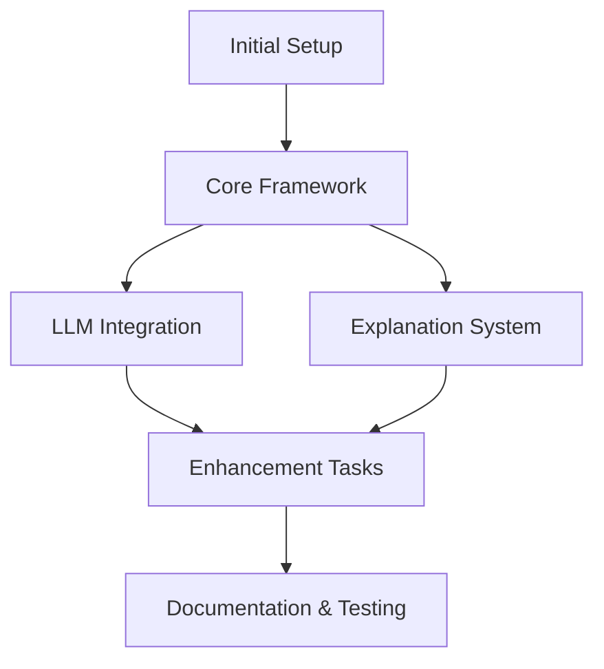

# LLM-Block-System
## Implementation Plan (Kanban Approach)

This plan outlines a Kanban-style approach for implementing the LLM-Block-System. Tasks are organized by state and priority rather than by timeline.

## Kanban Board Structure

### Backlog
Tasks that are defined but not yet ready to be worked on

### Ready
Tasks that are fully specified and ready to be picked up

### In Progress
Tasks currently being worked on

### Review
Tasks completed but awaiting review

### Done
Tasks that are completed and verified

## Initial Setup Tasks

- [ ] Initialize NextJS project with TypeScript
- [ ] Set up basic project structure following TDD
- [ ] Install dependencies (Vercel AI SDK, Zod, etc.)
- [ ] Configure linting and formatting
- [ ] Create initial GitHub repository
- [ ] Set up basic documentation structure

## Core Framework Tasks

- [ ] Implement core TypeScript interfaces
- [ ] Create basic Zod schemas for validation
- [ ] Build BlockSystemContext
- [ ] Implement BlockSystemProvider with basic state
- [ ] Set up useBlockSystem hook with essential functionality
- [ ] Create simple BlockRenderer component
- [ ] Implement basic error boundary
- [ ] Build placeholder components
- [ ] Set up component registry mechanism
- [ ] Create sample block components for testing

## LLM Integration Tasks

- [ ] Integrate Vercel AI SDK
- [ ] Implement prompt construction utilities
- [ ] Create JSON stream parser
- [ ] Build block parsing logic
- [ ] Set up basic error handling for LLM responses
- [ ] Implement ContentPrompt component
- [ ] Create loading states and indicators
- [ ] Build basic error display components
- [ ] Connect block generation to renderer
- [ ] Implement simple block boundaries for debugging

## Explanation System Tasks

- [ ] Implement explanation data model
- [ ] Create ExplanationRenderer component
- [ ] Build useBlockExplanations hook
- [ ] Connect explanations to blocks
- [ ] Create toggle functionality for explanations

## Enhancement Tasks

- [ ] Improve error handling and recovery
- [ ] Add validation for block props
- [ ] Implement better visual debugging tools
- [ ] Create utilities for block manipulation
- [ ] Optimize streaming performance
- [ ] Refine component APIs
- [ ] Add type guards and runtime checks
- [ ] Improve error messages
- [ ] Create helper utilities for common operations

## Documentation & Testing Tasks

- [ ] Write unit tests for core functionality
- [ ] Create integration tests for key flows
- [ ] Test with various error conditions
- [ ] Benchmark performance
- [ ] Create comprehensive README
- [ ] Write component API documentation
- [ ] Build usage examples
- [ ] Create troubleshooting guide
- [ ] Document extension points
- [ ] Build complete demo application
- [ ] Create video walkthrough

## Key Milestones

These milestones represent significant achievements in the project, regardless of timeline:

1. **Functional Framework**: Basic framework structure and components
2. **MVP**: Functional MVP with LLM integration
3. **Complete Feature Set**: Full system with explanations
4. **Production-Ready**: Finished with documentation and examples

## Task Dependencies



## AI Assistance Workflow

For each task:

1. **Definition**: Clearly define the task requirements and interface
2. **Scaffolding**: Use AI to generate skeleton code
3. **Implementation**: Use AI to help with detailed implementation
4. **Review**: Have AI review code for issues
5. **Testing**: Use AI to generate test cases
6. **Documentation**: Use AI to help document the component

## Repository Structure

```
llm-block-system/
├── src/
│   ├── lib/
│   │   ├── block-system/         # Core functionality
│   │   └── utils/                # Helper utilities
│   ├── components/               # React components
│   └── hooks/                    # React hooks
├── examples/                     # Example implementations
├── docs/                         # Documentation
└── tests/                        # Test suites
```

## Issues Tracker Initial Setup

Create the following issue labels:
- `core`: Core system functionality
- `ui`: User interface components
- `docs`: Documentation tasks
- `bug`: Issues and bugs
- `enhancement`: Feature enhancements
- `mvp`: Critical for MVP
- `phase-2`: Second phase features
- `good-first-issue`: Simpler tasks
- `blocked`: Tasks that are blocked by other tasks
- `ready`: Tasks that are ready to be worked on

## Next Steps After Initial Implementation

1. Support for hierarchical blocks
2. More sophisticated validation
3. Block transformation utilities
4. Performance optimizations
5. Additional framework adapters